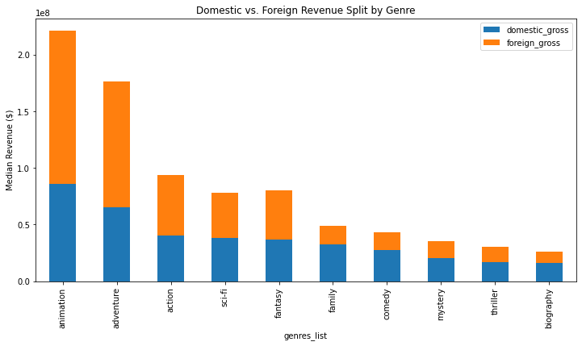
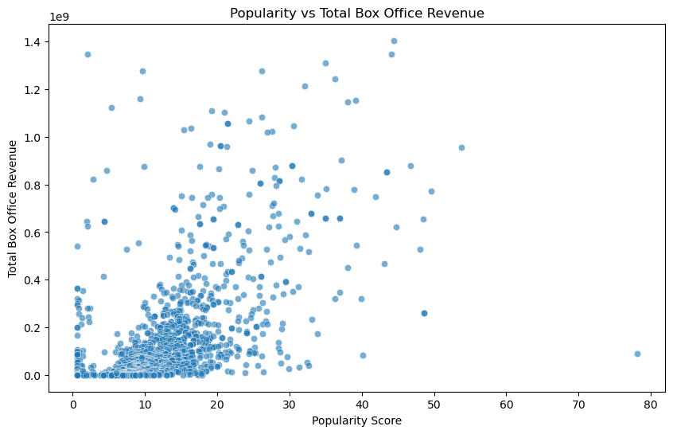

<<<<<<< HEAD
# YE Studios: Data-Driven Film Analysis Project
=======

  

<h1 align="center">YE Studios: Data-Driven Film Analysis Project</h1>
>>>>>>> origin/master

## Team Members
- Daniella Muli
- Naomi Opiyo
- Pheonverah Achieng'
- Eve Michelle
- Jack Mwangi

---

## Introduction

The entertainment industry has undergone a revolutionary transformation in recent years, with **data-driven decision-making** emerging as the cornerstone of success in film production. Companies like Netflix, Amazon Studios, and A24 have demonstrated that combining creative vision with rigorous statistical analysis produces superior outcomes compared to relying solely on industry conventions or intuition.

Netflix’s groundbreaking approach provides a compelling example. When greenlighting *House of Cards*, decisions were informed not by traditional pitch meetings but by detailed audience data showing preferences for political dramas, David Fincher’s directorial style, and Kevin Spacey’s performance. This methodology proved extremely successful, validating the power of analytics in content creation. Similarly, studios like Blumhouse have optimized the horror genre by identifying the ideal budget-to-revenue model, producing critically acclaimed films under $5 million that generate returns exceeding 100%.

As **YE Studios** enters this competitive landscape, our challenge mirrors that of industry leaders: how to translate vast datasets into actionable insights that drive commercial success. This project explores the intricate world of cinema, analyzing how **genre, budget, runtime, ratings, and studio strategies** interact to influence global film revenue. The ultimate goal is to provide clear, data-backed recommendations to guide YE Studios’ content strategy.

---

## Business Understanding

The film industry is a high-risk, high-reward environment where production decisions—such as **genre choice, budget allocation, and target audience**—can determine whether a movie is a blockbuster or a financial disappointment. For **YE Studios**, leveraging data-driven insights is essential for both survival and growth.

While major studios like Netflix capitalize on massive user datasets, independent studios like Blumhouse and A24 show that **smarter, targeted investments** can yield extraordinary returns. YE Studios aims to position itself strategically by identifying market gaps and untapped opportunities using analytics.

Key business questions include:

- Which genres or genre combinations consistently deliver the highest global revenue, and where are underserved niches with lower competition?
- Which genres have stronger international appeal, maximizing global revenue potential?
- What is the optimal budget range to achieve maximum ROI?
- How do independent studios compare with major studios in terms of ratings and revenue performance?
- How do ratings, popularity, and marketing correlate with financial success?
- How do domestic vs. international markets respond to different genres, and should content strategies vary by region?
- Are there seasonal or temporal trends in box office performance across genres?

Answering these questions equips YE Studios with a **data-validated playbook**, helping it compete effectively against established players while minimizing financial risk and maximizing the likelihood of producing both critically acclaimed and commercially successful films.

---

## Data Understanding

This analysis integrates five authoritative datasets, each providing unique insights:

1. **IMDB Database**
   - Comprehensive movie information, including titles, genres, average ratings, vote counts, runtime, and release years.
   - Popularity and audience sentiment data inform the relationship between film quality, marketing, and commercial performance.

2. **Box Office Mojo**
   - Domestic and international revenue data.
   - Studio attribution and release timing allow for competitive benchmarking and seasonal analysis.

3. **Rotten Tomatoes**
   - Professional critic and audience ratings.
   - Provides insight into critical vs. commercial success.

4. **The Movie Database (TMDB)**
   - Community-driven metadata including genre classifications, popularity scores, and user engagement.
   - Enables nuanced analysis of emerging trends and hybrid genres.

5. **The Numbers**
   - Production budget and financial performance data.
   - Critical for calculating ROI and assessing profitability across different genres and budget levels.

---

## Data Integration

Datasets were merged using **movie titles** as the common identifier to create a comprehensive database combining:

- **Financial performance** (Box Office Mojo, The Numbers)
- **Audience sentiment** (IMDB, TMDB)
- **Critical reception** (Rotten Tomatoes)

**Integration considerations:**

- Standardizing movie titles across datasets
- Handling missing values, duplicates, and inconsistent formatting
- Harmonizing genre classifications
- Normalizing revenue for inflation and currency differences
- Cross-checking budget data against revenues
- Aligning release dates for temporal analysis

This integrated dataset allows for a **multidimensional analysis** of how genre, budget, runtime, ratings, and studio characteristics influence commercial success.

---
## Data Cleaning & Analysis

All preprocessing and analysis work was conducted in Jupyter notebooks. You can access them directly below:

<<<<<<< HEAD
- **Data Cleaning:** [data_cleaning.ipynb](notebooks/data_cleaning.ipynb)
- **Market Dynamics Analysis:** [Market Dynamics Analysis.ipynb](notebooks/Market%20Dynamics%20Analysis.ipynb)
- **Financial Optimization Analysis:** [Financial Optimization Analysis.ipynb](notebooks/Financial%20Optimization%20Analysis.ipynb)
- **Genre & Content Strategy Analysis:** [Genre & Content Strategy Analysis.ipynb](notebooks/Genre%20&%20Content%20Strategy%20Analysis.ipynb)
- **Competitive Positioning Analysis:** [Competitive Positioning Analysis.ipynb](notebooks/Competitive%20Positioning%20Analysis.ipynb)

## Genre & Content Strategy (Statistical Analysis)

### Objective

Leverage the integrated dataset to identify genres and content types that deliver the **highest financial returns**, **strongest ROI**, and **broad international appeal**.

### Key Analyses & Findings

1.  **Correlation Analysis**
    
    *   Explored relationships between **budget, popularity, ratings, ROI, and worldwide gross**.
        
    *   **Findings:**
        
        *   **Budget → Revenue:** Strong correlation (0.79)
            
        *   **Popularity → Revenue:** Moderate correlation (0.58)
            
        *   **Critical Ratings → Revenue:** Weak correlation (0.21)
            
2.  **Revenue Analysis by Genre**
    
    *   **Top Performers:** Animation, Adventure (median $150M–$200M per film)
        
    *   **Mid-Tier:** Sci-Fi, Action, Fantasy
        
    *   **Niche/Lower Revenue:** Horror, Documentary
        
    *   **Statistical Validation:** ANOVA confirms genre significantly impacts revenue (p < 0.05)
        
3.  **Market Gap Analysis ("A24 Strategy")**
    
    *   Scatter plot of **ROI vs production volume** identifies underserved, high-return niches: Mystery, Horror, Sci-Fi
        
    *   Animation represents **high-risk, high-reward** blockbusters
        
4.  **International Appeal**
    
    *   Calculated average foreign gross share by genre:
        
        *   **Universal Appeal (55–60% international):** Animation, Adventure, Action
            
        *   **Domestic-Centric:** Comedy, Documentary
            

**Recommendation:**  
Adopt a **dual-track content strategy**:

*   **Core Production:** Mid-to-low budget Mystery & Horror → maximize ROI with limited capital
    
*   **Flagship Production:** Animation & Adventure → global revenue, brand-building

  
  

## Financial Optimization Analysis

### Objective

## 

Determine **budget allocation, ROI efficiency, and profitability trends** across the portfolio to inform production and investment decisions.

### Key Analyses & Findings

## 

1.  **ROI Distribution & Outliers**
    
    *   Low-budget niche films can deliver stronger ROI than large-scale blockbusters
        
2.  **Budget vs Revenue Modeling**
    
    *   Diminishing returns observed beyond certain budget thresholds
        
    *   Provides **optimal budget ranges per genre**
        
3.  **Production Scale Recommendations**
    
    *   Low-to-mid budget: Mystery, Horror, Sci-Fi → maximize ROI efficiently
        
    *   High-budget flagship: Animation, Adventure → maximize global visibility
        
    *   Domestic-focused: Comedy, Documentary → keep budgets lean

  

=======
- **Data Cleaning:**  
  [data_cleaning.ipynb](notebooks/data_cleaning/data_cleaning.ipynb)

- **Market Dynamics Analysis:**  
  [Market Dynamics Analysis.ipynb](notebooks/analysis/Market%20Dynamics%20Analysis.ipynb)

- **Financial Optimization Analysis:**  
  [Financial Optimization Analysis.ipynb](notebooks/analysis/Financial%20Optimization%20Analysis.ipynb)

- **Genre & Content Strategy Analysis:**  
  [Genre & Content Strategy Analysis.ipynb](notebooks/analysis/Genre%20%26%20Content%20Strategy%20Analysis.ipynb)

- **Competitive Positioning Analysis:**  
  [Competitive Positioning Analysis.ipynb](notebooks/analysis/Competitive%20Positioning%20Analysis.ipynb)

## Key Findings: Strategic Insights for YE Studios

This project applies data-driven analysis to identify how **YE Studios** can scale sustainably by optimizing budget strategy, genre selection, and distribution approach.

* * *

### 1\. Financial Strategy & Risk Management

*   **Micro-budget films (< $5M)** deliver exceptionally high returns, averaging **~842% ROI**, making them ideal for low-risk experimentation and early capital growth.
    
*   **Mid-budget films ($15M–$50M)** remain viable, achieving a stable **~164% ROI**, and are well-suited for brand-building and studio credibility.
    
*   **Major studios outperform indies by ~58% in revenue**, largely due to distribution strength.
    
    *   **Takeaway:** YE Studios should pursue _major-style distribution partnerships_ even for smaller productions.
        

* * *

### 2\. Genre & Content Strategy

*   **Animation, Adventure, and Action** show strong global scalability, earning **55–60% of revenue from international markets**.
    
*   **Horror and Mystery** emerge as high-ROI, lower-competition genres compared to saturated categories like Drama and Comedy.
    
    *   **Takeaway:** Prioritize visual-first genres for global releases and keep budgets lean for domestically focused genres (e.g., Comedy) to protect ROI.
    

* * *

### 3\. Market Dynamics & Audience Engagement

### 

Popularity and marketing buzz often outweigh critical acclaim in predicting commercial success.

*   **Popularity Drives Revenue:** Audience engagement scores show a significantly stronger correlation with revenue than critical ratings.
    
*   **The Quality Myth:** High IMDB/Metacritic ratings build studio prestige but do not guarantee profit without aggressive visibility.
    
*   **Marketing-Led Production:** Films with early audience "buzz" perform better on opening weekends, which dictates the total box office trajectory.
    
   *   **Takeaway:** YE Studios should integrate marketing into the production pipeline from Day 1. Visibility and cultural presence are stronger predictors of success than critical acclaim alone.
    

### 4\. Competitive Positioning & Seasonality

### 

Strategic timing and global allocation are essential for outperforming established competitors.

*   **The Foreign Advantage:** Statistical testing confirms that international revenue significantly outperforms domestic revenue across all major genres ($p < 0.001$).
    
*   **Seasonality Trends:** ANOVA results ($F = 8.06$) prove that box office performance is highly seasonal, with massive revenue peaks in specific windows.
    
*   **Strategic Allocation:** Reserve peak windows (**May–July** and **Nov–Dec**) for flagship films; use "quiet" months for high-ROI genres like Horror to avoid competition.
    
   *   **Takeaway:** Allocate **60–80% of marketing budgets** to international markets and align release dates with global demand patterns rather than domestic-first strategies.

---

### **Overall Insight**

The analysis demonstrates that sustainable success for **YE Studios** is driven by strategic alignment rather than scale alone. High returns are achieved by pairing **disciplined budget management** with **data-backed genre selection**, **marketing-led production**, and **globally informed release strategies**.

Micro- and mid-budget films provide the strongest risk-adjusted returns when combined with genres that scale internationally, while audience engagement and visibility outperform critical acclaim as predictors of commercial success. Additionally, international markets and seasonal release timing play a decisive role in maximizing revenue potential.

**Core Takeaway:** YE Studios’ competitive advantage lies in operating as a *data-first studio*—deploying capital efficiently, prioritizing global audiences, integrating marketing early, and releasing content strategically based on market dynamics rather than industry intuition.

---

### 📊 Visual Insights (from Analysis)

Selected visuals below highlight the core findings of our analysis.  
Full interactive versions are available via Tableau dashboards.

---

#### 💰 ROI by Budget Tier

*High ROI concentration in micro- and mid-budget films.*

---

#### 🌍 Domestic vs International Revenue by Genre

*International markets consistently outperform domestic revenue across major genres.*

---

#### ⭐ Popularity vs Revenue

*Audience engagement shows a stronger relationship with revenue than critical ratings.*

---

### 📈 **Interactive Dashboards (Tableau)**

For a deeper, interactive exploration of the data, view the Tableau dashboards below:

- **Financial Strategy & Risk Management**  
  👉 [View Tableau Dashboard](https://public.tableau.com/app/profile/naomi.opiyo/viz/YE_Studios_Financial_Analysis_Dashboard/Story1)

- **Genre & Content Strategy**  
  👉 [View Tableau Dashboard](https://public.tableau.com/views/MovieAnalysisProject/Dashboard1?:language=en-US&publish=yes&:sid=&:redirect=auth&:display_count=n&:origin=viz_share_link)

- **Market Dynamics & Audience Engagement**  
  👉 [View Tableau Dashboard](https://public.tableau.com/views/MARKETINGDYNAMICS/Dashboard2?:language=en-US&publish=yes&:sid=&:redirect=auth&:display_count=n&:origin=viz_share_link)

- **Competitive Positioning & Seasonality**  
  👉 [View Tableau Dashboard](https://public.tableau.com/views/CompetitivePositioningAnalysis/Dashboard1?:language=en-US&publish=yes&:sid=&:redirect=auth&:display_count=n&:origin=viz_share_link)
>>>>>>> origin/master
